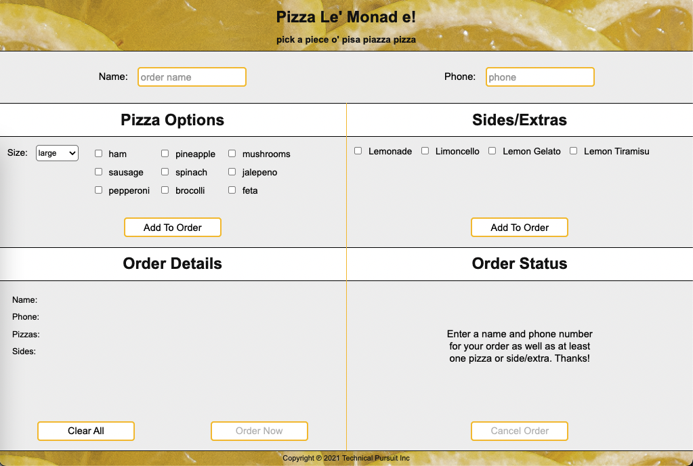
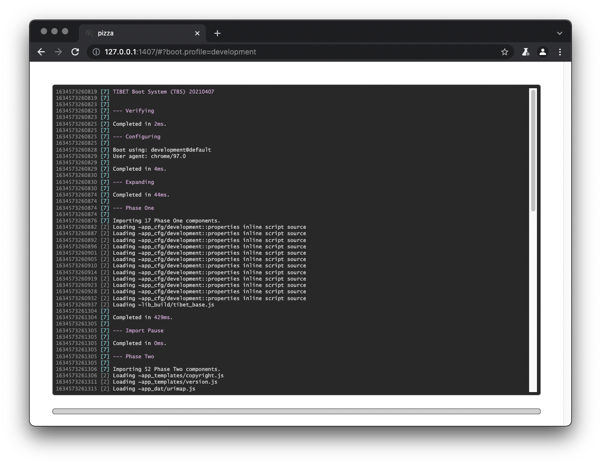
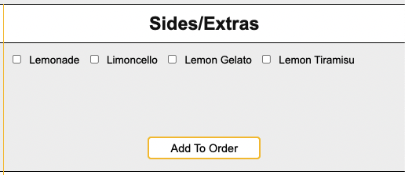

# Pizza Le' Monad e!


## Overview

Inspired by a failed attempt to build a pizza-ordering application under
pressure, the Pizza Le' Monad e! application is a tongue-in-cheek exercise in
turning lemons into lemonade.

    "Your only true failures are the unexamined ones." -- Scott Shattuck

In the spirit of examination and growth, Pizza Le' Monad e! was undertaken to
help TIBET grow, to use the main features of TIBET, ensuring each worked
as intended, was easy to use, and had complete code samples and test coverage.

In particular, the pizza application focuses on leveraging TIBET's:

- Markup-first authoring (XHTML templates linked to Object-Oriented types)
- Orthagonal markup enhancement via namespaced attributes (Markup "mixins")
- Shared data modeling across components using industry-standard URN syntax
- Signal-driven behavior modeling (minus all add/remove listener overhead)
- Full-stack functionality including quick and easy route/mock construction.

Note that this application is considered a permanent work-in-progress, evolving
and expanding as to include more of TIBET's functionality over time. It's also
intended to be the go-to sample you refer to when you want to see various
aspects of TIBET in action.

That unscripted code challenge is gonna go a whole lot smoother next time ;)

## Installation

_If you're new to TIBET start with [TIBET Quickstart](https://tibetjs.com/docs/quickstart.html) and [TIBET Essentials](https://tibetjs.com/docs/essentials.html)._

To work with this demo application first install/initialize TIBET:

```
npm install -g tibet
tibet init
```

Next, use `git clone` to clone the `TIBET-Examples` repository:

```
cd $WORKDIR
git clone git@github.com:TechnicalPursuit/TIBET-Examples.git
```

Once the clone is ready, `cd` to the `pizza` project subdirectory and use `tibet
init` to initialize the project and get it ready for use:

```
cd TIBET-Examples/pizza
tibet init
```

With those steps complete you're ready to run the application.

## Startup

To start the `pizza` application's TIBET server use `tibet start`:

```
tibet start

...snipped...

1634526311463 [7] TDS pizza 0.1.0 @ http://127.0.0.1:1407#?boot.profile=development (dev)
1634526311463 [7] TDS pizza 0.1.0 @ http://127.0.0.1:1407 (production build) (build)
1634526311463 [7] TDS Application Started (server)
```

_NOTE: to use a different port use the --port flag: tibet start --port NNN._

Once the server starts you'll see lines similar to those above. Use the first
link marked (dev) to open the application home page in your default browser:

```
http://127.0.0.1:1407#?boot.profile=development
```

_NOTE: Chromium-based browsers (Chrome, Edge Chromium, etc) are recommended._

The primary application interface should resemble this screenshot:



## Operation

Using the application is simple.

To enable sending an order to the server you need to enter a name, phone number,
and at least one pizza or side dish. Name and phone number are simple text entry
fields. Pizzas and side dishes are added via the `Add To Order` buttons
respectively.

You can clear/reset the UI at any time using the `Clear All` button.

Once you've provided a name, phone number, and at least one product the `Order
Now` button will activate, allowing you to send the order JSON to the server.

In the demo application the server's `/order` route simply adds a timestamp and
status code and returns the order. The client responds by rendering that
information in the `Order Status` section, deactivating the `Order Now` button,
and activating the `Cancel Order` button.

With the order "pending" you can either cancel it (which sends it back to the
server for a status update) or use `Clear All` to set yourself up to enter a new
order.

That's it.

Of course, the point isn't to order a pizza, it's to provide a foundation for
testing and demonstrating key TIBET features.

Let's start with a look at the TIBET stack's primary components.

## Full Stack

It's been said a key differentiating factor between libraries and frameworks is
"you call libraries; frameworks call you."

By that measure TIBET is a true framework, and a full-stack framework at that.

### TIBET Data Server (TDS)

When you invoke `tibet start` TIBET's Node.js+Express-based TIBET Data Server
(TDS) launches and loads a set of configurable plugins handling security,
logging, etc.

The TDS also scans pre-defined 'routes' and 'mocks' directories, loading any
published route handlers it finds. Sample files are contained in each of these
directories so you have a starting point for server-side route and mock
development.

From plugins to routes to mocks, place things in the proper directory and the
TDS will automatically handle loading and integrating them. IOW, the TDS calls
you.

#### `/order` Route

For the pizza application the relevant route file is `routes/order_post.js`, a
modified copy of the `routes/_sample_app_post.js` file included in every new
TIBET project.

To enable the `/order` route all that was needed was to copy the sample file
and update its `app.post` call as follows:

```
//  NOTE: to parse JSON or other content you need to define the specific
//  options.parsers value(s) your route relies upon. Here it's 'json'.

app.post('/order', options.parsers.json, function(req, res) {
    let response;

    logger.info(TDS.beautify(req.body));

    //  Simple implementation updates the order timestamp value and sets
    //  a new status based on whatever status was sent to us.
    req.body.received = Date.now();
    switch (req.body.status) {
        case 'pending':
        case 'cancelled':
            req.body.status = 'cancelled';
            break;
        default:
            req.body.status = 'pending';
    }

    res.json(req.body);
});
```

#### `/order` Testing

Each sample file includes instructions on how to test that route, typically by
using `curl` in combination with one or more static files from the `mocks`
directory.

To test the `/order` order route a pair of JSON files were created with the JSON
for a typical new or existing order:

##### `mocks/mock_neworder_post.json`

```
{
    "name":"Technical Pursuit Inc.",
    "phone":"720-675-7064",
    "pizzas":[
        {"diameter":"large","toppings":["sausage","jalepeno"]},
        {"diameter":"large","toppings":["ham","pineapple","mushrooms"]}
    ],
    "sides":["limoncello","lemon tiramisu"]
}
```

Invoking `curl` with that mock file lets us confirm the `/order` route is
working as intended:

```
$ curl -XPOST http://127.0.0.1:1407/order \
    --header "Content-Type: application/json" \
    --data "@./mocks/mock_neworder_post.json"

{"name":"Technical Pursuit Inc.","phone":"720-675-7064","pizzas":[{"diameter":"large","toppings":["sausage","jalepeno"]},{"diameter":"large","toppings":["ham","pineapple","mushrooms"]}],"sides":["limoncello","lemon tiramisu"],"received":1634528302460,"status":"pending"}
```

With the server route in place and tested it's time to move to the client.
Before we go however, the TDS has one more feature worth mentioning....

#### Hot-Patching (not reloading)

In addition to auto-loading plugins, routes, and mocks, the TDS optionally
observes all assets vended to the client and notifies the client of any edits
you make within your source tree.

Asset observation is provided by the TDS's `watch` plugin. When `NODE_ENV` is
`development` the `watch` plugin is automatically loaded.

You can confirm the `watch` plugin is active by viewing the TDS's startup log:

```
...
1634526311357 [7] TDS loading tds plugin (watch)
1634526311357 [3] TDS TDS FileWatch interface creating file watcher. (watch)
...
1634526311463 [7] TDS Application Started (server)
```

The TIBET Client includes hot-patch functionality so your changes can be
automatically integrated without reloading, preserving client-side application
state.

Launching the client using a `development` or `contributor` profile activates
the watcher. You can confirm this by viewing the server's console log:

```
1634526313222 [3] TDS Processing file watch request from ::ffff:127.0.0.1 (watch)
1634526313327 [3] TDS Opening SSE notification channel to ::ffff:127.0.0.1 (watch)
1634526313327 [3] TDS TDS FileWatch connection count updated to 1 (watch)
```

TIBET's hot-patch functionality supports changes to your application's CSS,
XHTML templates, and types with minimal reloads, dramatically speeding
development.

### The TIBET Client

The TIBET Client is unique, covering the entire [Client Stack](https://tibetjs.com/docs) from configuration to widgetry and everything in between. This is in contrast to what we refer to as a-la-carte libraries, libraries where each project is composed of a random assortment of modules and tools.

    TIBET's not a-la-carte, it's all-the-parts.

A short list of TIBET Client features exposed/leveraged in this demo includes:

- [configuration](https://tibetjs.com/docs/configuration.html)
- [loading](https://tibetjs.com/docs/loader.html)
- [logging](https://tibetjs.com/docs/logging.html)
- [primitives](https://tibetjs.com/docs/primitives.html)
- [oo & traits](https://tibetjs.com/docs/oo.html)
- [signaling](https://tibetjs.com/docs/signaling.html)
- [urls/urns](https://tibetjs.com/docs/uris.html)
- [content](https://tibetjs.com/docs/content.html)
- [queries/paths](https://tibetjs.com/docs/paths.html)
- [templating](https://tibetjs.com/docs/templating.html)
- [data binding](https://tibetjs.com/docs/data-binding.html)
- [custom tags](https://tibetjs.com/docs/tag-system.html)

As we touch on these in the rest of this document we'll try to call each one out.

#### Application Loading

Opening the pizza application URI loads a splash page containing the [TIBET Configuration](https://tibetjs.com/docs/configuration.html) layer and the [TIBET Loader](https://tibetjs.com/docs/loader.html), two of the key elements of the TIBET Client Stack.

The `#?boot.profile=development` fragment on the application URI defines a TIBET configuration value which informs the TIBET Loader what profile to load. You can alter any `boot.*` parameter (with certain restrictions) by adding it to the URI fragment.

The TIBET Loader loads the specified `boot.profile` (essentially a named manifest) and then proceeds to load the application assets defined there. As the application loads you'll see a progress bar as the library and application code are loaded.

As it loads and activates the application leverages the [TIBET Logging](https://tibetjs.com/docs/logging.html) subsystem. This logging foundation includes both a "boot log" and typical application level logging.

To view the boot log use `Alt-UpArrow` (aka `Option-UpArrow`):



If you open Chrome DevTools you'll also see TIBET log output in the console.

The logging layer has `TP.*` and `APP.*` APIs. Log messages from TIBET typically show a 'TIBET' prefix while those from your application components are prefixed by 'APP', making it easier to differentiate between framework and application messages.

#### Application Rendering

Once the application assets are ready the application is started and the splash screen is replaced with the application's root page. This root page can be summarized as:

```
<tibet:root/>
```

The `<tibet:root/>` tag renders your application's "app tag" (`pizza:app` in this case) with optional development-support components depending on your boot profile.

The default rendering of `<tibet:root/>` effectively translates to:

```
<html>
    <head/>
    <body>
        <pizza:app id="app"/>
    </body>
</html>
```

TIBET's focus on XML/XHTML tags is why we call it a "markup first" framework.

When developing with TIBET you work from the app tag down, outlining the interface and basic functionality via tags, then augmenting those tags with functionality. This approach is in contrast to tools which require you to write code to produce markup.

## `pizza:app`

The `pizza:app` tag is, for this app, the first application-specific tag TIBET renders.

At the rendering level you can think of tags as macros which optionally expand to
produce new content in the DOM. _(Not all TIBET tags are UI tags as we'll see.)_

One standout feature is that TIBET is a fully-compliant XML/XHTML platform,
meaning the rendering surface is an XML surface containing XHTML, not a
"tag soup" surface.

In TIBET it's often the case that authored XML tag(s) are retained, keeping
the markup semantically differentiated (no div-itis).

Once fully-expanded, the pizza application is composed of these key tags:

```
<pizza:app>
    <header/>
    <div class="body">
        <pizza:info/>
        <pizza:entry>
            <pizza:options/>
            <pizza:sides/>
        <pizza:entry>
        <pizza:order>
            <pizza:orderdetails/>
            <pizza:orderstatus/>
        </pizza:order>
    </div>
    <footer/>
</pizza:app>
```

The majority of the pizza application's functionality is found in the "leaf"
tags:

- pizza:options
- pizza:sides
- pizza:orderdetails
- pizza:orderstatus

These foundational tags all use a common structure which lets them display a
section header, content region, and footer for buttons:

```
<header/>
<div class="body">
    ...content...
</div>
<footer/>
```

The `public/src/tags` directory contains a directory for each tag. Each tag
bundle contains the tag's xhtml file (if it's templated), its CSS, its `.js`
source and test files, and a tag manifest used by the loader and other TIBET
infrastructure tools (linter, tester, etc.).

Let's take a closer look at one of these tags, starting with the markup (of
course ;)).

## `pizza:sides`

The `pizza:sides` tag's role in the application is to render the side-dish
options (anything that's not a pizza). Here's a refresher:



Below is a comment-stripped version of the `pizza:sides` tag template. _(Before
you panic over CDATA blocks etc. recall this is about demonstrating what's
possible. :))_

### `pizza:sides.xhtml`

```
<pizza:sides>

    <tibet:data name="urn:app:pizza_sides" content="Array">
    <![CDATA[
        ["lemonade", "limoncello", "lemon gelato", "lemon tiramisu"]
    ]]>
    </tibet:data>

    <header>
        <h1>Sides/Extras</h1>
    </header>

    <div class="body" bind:repeat="urn:app:pizza_sides">
        <span class="field">
            <input name="{{$_}}" type="checkbox" value="{{$_}}"/>
            <label for="{{$_}}"
                on:click="{signal: ToggleItem, payload: {name: {{$_}}}}">{{$_ .% titleCase}}</label>
        </span>
    </div>

    <footer>
        <button name="sides" on:click="AddSides">Add To Order</button>
    </footer>
</pizza:sides>
```

Note that:

- **This template is fully-functional in terms of rendering. It renders the
  `pizza:sides` UI without requiring a single line of JavaScript source code.**

    Why does that matter? It makes it perfect for low-code drag-and-drop GUI tooling.

- The file is XML/XHTML and can be checked for well-formedness and validity
  against an XML schema if that's necessary or desirable. (Handy for shared tag
libraries).
- The markup is augmented by cross-cutting namespaced attributes in the
  TIBET-supplied `bind:` and `on:` namespaces.
- Commenting is a simple matter of using industry-standard XHTML comments.

### markup "mix-ins"

In much the same way traits allow you to "mix in" functionality to TIBET types,
TIBET's `bind:`, `on:`, `ui:`, and other namespaces let you mix functionality
into markup... any markup.

#### bind:

The use of a `bind:repeat` causes any child content of the element it resides on (the `<span class="field">` and its children in this case) to be extracted and used as a repeating template, blending features of TIBET [Data Binding](https://tibetjs.com/docs/data-binding.html) and [Templating](https://tibetjs.com/docs/templating.html).

The `bind:repeat` references `urn:app:pizza_sides`, a [TIBET URI](https://tibetjs.com/docs/uris.html) (specifically a TIBET URN) to point to the data being bound. For this usage the bind points to the URN defined by the `tibet:data` tag (which has the list of side dishes).

Data accessed via TIBET URIs is typically wrapped in an Object-Oriented container to make working with it easier. These containers are typically [TIBET Content Types](https://tibetjs.com/docs/content.html).

TIBET's content types provide a way to encapsulate raw data behind a get/set API that insulates your code from changes in the low-level data structures.

#### {{ }} templates

The templating block syntax `{{ }}` supports a variety of pre-built variables
and functions as well as custom extensions. In this template we use `$_` which
refers to the current iteration value and `.% titleCase` as a small data
formatting pipe so the label value is in title case.

See the [TIBET Templating](https://tibetjs.com/docs/templating.html) documentation for more examples and information.

#### on:

TIBET's `on:*` attributes allow you to remap DOM events and signals into
higher-level semantic signals which can be handled anywhere on the [responder
chain](https://tibetjs.com/docs/signaling.html#tagresp).

The `defineHandler` method in `APP.pizza.sides.js` is used to define the
specific functions which will handle these events. There's no `addListener` or
`removeListener` overhead or leak potential, [TIBET Signaling](https://tibetjs.com/docs/signaling.html) takes care of
everything.

### `tibet:*`

While most frameworks use tags only for UI rendering TIBET also includes `info`
and `action` tags which can supply data or perform actions in response to
events.

The pizza application uses `tibet:data` tags to demonstrate non-UI tags while
also showing one way to reduce or eliminate source code related to UI rendering.

The [TIBET Tag System](https://tibetjs.com/docs/tag-system.html) documentation
outlines the main features of TIBET's info, and action, templated, and computed
tags.

The `pizza:orderstatus` tag is a good example of a `TP.tag.ComputedTag`, a tag
whose content is produced by a JavaScript method rather than an XHTML template.


## Types and Traits

TIBET's markup-first approach is made possible by a number of features, but none
is more important than TIBET's powerful [OO + Traits](https://tibetjs.com/docs/oo.html) foundation.

    "Behind every good tag is a good type." - TIBET mantra :)

Flexible feature reuse is the driving force behind TIBET's OO + Traits subsystem.

To maximize reuse while reducing maintenance issues you can use inheritance for
core functionality and dynamic trait mixins to manage cross-cutting features
efficiently.

### `pizza:sides.js`

The best example of how types and traits are leveraged in the pizza application
is the `pizza:sides` type and its integration of traits from the `pizza:items`
type:

```
//  ========================================================================
/**
 * @type APP.pizza.sides
 * @summary Tag type which manages the pizza sides portion of the UI. This tag
 * is where drinks, desserts, etc. are added to the order.
 */
//  ------------------------------------------------------------------------

TP.tag.TemplatedTag.defineSubtype('APP.pizza:sides');

APP.pizza.sides.defineAttribute('themeURI', TP.NO_RESULT);

//  Mix in checkbox items utility methods from the APP.pizza.items Type. NOTE
//  that we resolve the getItems method to ensure we get the one being provided
//  by the APP.pizza.items mixin rather than the inherited implementation.
APP.pizza.sides.addTraits(APP.pizza.items);
APP.pizza.sides.Inst.resolveTraits(TP.ac('getItems'), APP.pizza.items);

//  Static data used to drive the list of available sides/extras in the UI.
APP.pizza.sides.Type.defineConstant('SIDES',
    TP.ac('lemonade', 'limoncello', 'lemon gelato', 'lemon tiramisu'));

//  ------------------------------------------------------------------------
//  Inst Attributes
//  ------------------------------------------------------------------------

APP.pizza.sides.Inst.defineHandler('AddSides',
function(aSignal) {

    /**
     * @method handleAddSides
     * @summary Responds to activation of the "Add To Order" button by ensuring
     *     the order is updated with any new sides/extras which are selected.
     * @param {TP.sig.Signal} aSignal The signal.
     */

    //  Update payload with current data values and let it bubble. The
    //  payload will be leveraged to update the raw order higher up.
    aSignal.setPayload(this.getSelectedValues());

    this.resetItems();
});

//  ------------------------------------------------------------------------
//  end
//  ========================================================================
```

From an inheritance perspective `pizza:sides` is a `TP.tag.TemplatedTag`. This
means it automatically leverages an XHTML template (`APP.pizza.sides.xhtml`) to
render.

The majority of tags in the pizza app (and most TIBET applications) are
templated tags.

Through its inheritance from TemplatedTag and its supertypes the `pizza:sides`
tag gets a significant base feature set (event management, data binding,
templating, and more).

The `defineHandler` call for `AddSides` ensures the type is ready to
deal with signals fired by the `Add To Order` button whose `on:click` maps
click events to `AddSides`.

One cluster of features isn't supported out of the box however, namely the
ability to quickly find, select, clear, toggle, and otherwise work with
`input[type="checkbox"]` elements.

To address that limitation, `pizza:sides` gets its `getSelectedValues` and
`resetItems`, and `ToggleItem` handler functionality by mixing in `pizza:items`
as a set of traits.

### `pizza:items` (Traits)

Both the `pizza:sides` and `pizza:options` tags rely heavily on checkbox
elements. The pizza toppings are checkbox/label pairs. Drinks and desserts are
also checkbox/label pairs.

But is inheritance the best way to share checkbox field functionality?

In the pizza application the answer chosen was 'no' so a simple subtype of the
application's default root Object was created to house it:

```
APP.pizza.Object.defineSubtype('APP.pizza.items');

//  Prevent instantiation. This type is intended for use as a mixin.
APP.pizza.items.Type.isAbstract(true);
```

_NOTE: While not strictly required, you can set trait types to be abstract so
any attempt to create instances directly will raise an exception._

To access the checkbox elements a [TIBET
Path](https://tibetjs.com/docs/paths.html) is defined which integrates with
TIBET's `get` and `set` methods so any attempt to `get('itemsCheckboxes')` or
`set('itemCheckboxes')` automatically invokes the path and operates on the
resulting array of elements:

```
//  Access path for locating all checkbox items under a target "body" div.
APP.pizza.items.Inst.defineAttribute('itemCheckboxes',
    TP.cpc('> div[class="body"] input[type="checkbox"]',
        TP.hc('shouldCollapse', false)));
```

TIBET supports access paths for XPath 1.0, JSONPath, CSS queries, and a TIBET
syntax that's a Python-inspired syntax for traversal/slicing down an object
path. The `TP.cpc` primitive creates a new CSS Path that will locate the
checkbox items in a body div.

The remaining API is defined as instance methods on the `pizza:items` type:

- getItems
- getSelectedItems
- getSelectedValues
- reset
- resetItems

A common Signal handler is also defined via `defineHandler`:

- ToggleItem

By mixing in `pizza:items` functionality `pizza:options` and `pizza:sides`
gain new attribute values (the access path), new instance methods, and a new
signal handler.

### `pizza:options.js` and callNextMethod

One feature of TIBET's OO + Traits infrastructure deserves a special callout.

When you override a method in standard JavaScript you can use `super()` to
direct the engine to invoke any inherited implementation. It's not perfect
but it works for most cases.

TIBET's base inheritance implementation addresses the gaps in `super()`
invocation while also handling the introduction of traited methods.

In the specific example below, the `pizza:options` type has mixed in the
`pizza:items` type and aqcuired a `reset` method as a result of that mixin.

Because `pizza:options` has a `<select>` control that should be reset in
addition to the checkboxes it needs to override the traited method and
invoke it in the new method.

Of course, it can't use `super()` because `super()` has no concept of traits.
That's where TIBET's `callNextMethod` method comes in.

`callNextMethod` is aptly named in that it literally calls "the next method" in
the call chain, whether that "next method" is on the receiving object's direct
type, a mixed in trait, a supertype, a trait of that supertype, and so on.

```
APP.pizza.options.Inst.defineMethod('reset',
function() {

    /**
     * @method reset
     * @summary Reset all field values to their initial defaults.
     * @returns {APP.pizza.options} The receiver.
     */

    //  NOTE: this actually invokes a TRAIT method, 'reset', we acquired from
    //  mixing the APP.pizza.items type. The callNextMethod is unlike super() in
    //  that it works to find truly "the next method in the call chain".

    this.callNextMethod();

    this.setPizzaSize(APP.pizza.pizza.get('DEFAULT_SIZE'));

    return this;
});
```

Thanks to `callNextMethod` you can mix in functionality without losing control.

## Controllers

Tag types are a central aspect of authoring TIBET applications but not
everything in an application happens in the UI. That's where the TIBET
controller stack comes in.

Events in a browser typically start at the document, work downward to a target
node, then bubble upward to the document again.

TIBET signals start at the top of the controller stack and work downward,
descend into the DOM, change direction, and work upward from the target to the
top of the controller chain.

Capture and bubbling semantics are preserved, but controller objects can be
injected at the start of the capture sequence and the end of the bubbling
sequence.

Thanks to the controller chain you can quickly capture or provide backstop
functionality in response to lower-level `Event` and `TP.sig.Signal`
notifications.

### TP.core.Application

In a production setting the top of the controller chain is the `Application`
instance, accessible via `TP.sys.getApplication()`.

This instance is created automatically by TIBET during application startup from
a pre-built subtype of `TP.core.Application` provided for your application.

In the pizza app that Type is `APP.pizza.Application` and it's found in the
`public/src` directory of the project.

### APP.pizza.Application

The application instance is a common location to host "cross-component" data,
event signaling/handling, and other shared functionality.

For example, the `APP.pizza.Application` definition includes the following lines
of code which help manage the data for the current `order`:

```
//  Location used to share the Order data.
APP.pizza.Application.Type.defineConstant('orderURN', TP.uc('urn:app:order'));

//  Reference to the server-side URI we'll POST order requests to.
APP.pizza.Application.Type.defineConstant('serverURI', TP.uriExpandHome('/order'));

//  The order data. This is also shared as the content of the orderURN.
APP.pizza.Application.Inst.defineAttribute('order');
```

Instance methods on the application instance include the following:

- clearOrder
- getOrderURN
- getServerURI
- orderChanged

Each of these instance methods support working with the order data.

#### Lifecycle Signals

From a signal-handling perspective one of the more common application lifecycle
events is `AppDidStart` (others include AppWillStart, AppWillShutdown,
AppDidInitialize, etc.)

`AppDidStart` is invoked after all loading, initialization, and rendering of the
initial user interface is complete so it's the typical Signal to handle as a
kind of "kick off".

The pizza application uses `defineHandler` to be notified of `AppDidStart` so it
can perform an initialization of the order data:

```
APP.pizza.Application.Inst.defineHandler('AppDidStart',
function(aSignal) {

    /**
     * @method handleAppDidStart
     * @summary Responds to notification that the application has started. In
     *     particular, this invocation ensures the order is properly initialized
     *     and ready to capture data.
     * @param {TP.sig.Signal} aSignal The signal.
     */

    this.clearOrder();
});
```

The application instance also defines handlers for:

- UpdateOrderInfo (pizza:info)
- AddPizza (pizza:options)
- AddSides (pizza:sides)
- ClearOrder (pizza:orderdetails)
- SendOrder (pizza:orderdetails)

These additional signal handlers let the application coordinate with the various
UI components so the UI works without the individual components having to
connect directly to each other.

## Client/Server

Connecting the client and server is the last topic to cover.

Order initiation is handled by the `APP.pizza.Application` instance's
`SendOrder` signal handler, typically triggered by the `Order Now` button.

Order cancellation is handled by `pizza:orderstatus` instance's handler for
`CancelOrder`, triggered by its `Cancel Order` button.

Each of these handlers relies on what we call an HTTP "primitive", aka an
encapsulating function which stabilizes TIBET's APIs across platforms.

[TIBET Primitives](https://tibetjs.com/docs/primitives.html) cover an extensive
set of functions and provide a stable foundation for the rest of TIBET. While
they might appear to be "shims" they differ in that TIBET uses primitives to
create an dependable encapsulation layer rather that patching one-off functions.

Here's the `APP.pizza.Application` instance's `SendOrder` handler, which makes
use of the `TP.httpPost` primitive to POST our order JSON to the server:

```
APP.pizza.Application.Inst.defineHandler('SendOrder',
function(aSignal) {

    /**
     * @method handleSendOrder
     * @summary Responds to requests to send the order to the server for
     *     processing.
     * @param {TP.sig.Signal} aSignal The signal.
     */

    let order,
        request;

    order = this.get('order');

    //  Ensure we clear any status flag from prior state (such as pending or
    //  cancelled) since we allow server response fields in the order.
    delete order.status;

    //  Prep the request as a JSON string and prevent any further encoding.
    request = TP.hc('body', TP.json(order), 'noencode', true);
    APP.debug(request);

    //  Send to the server endpoint and handle success/failure. NOTE that using
    //  an arrow function here walks up the scope chain for 'this' resolution.
    TP.httpPost(this.getType().get('serverURI'), request).then((result) => {
        APP.debug(result);
        //  Update our order with the augmented (order status & time) order.
        this.set('order', JSON.parse(result));
        this.orderChanged();
    }).catch((err) => {
        //  Log any error but don't clear the order so we can resend etc.
        APP.debug(err);
    });
});
```

TIBET's `TP.http*` primitives return "thenables" (typically `Promise` instances)
which can be used to manage the async resolution/rejection processing.

_(TIBET's Response objects are also thenables and can participate in async chains.)_

In the specific case above we handle successful POST operations by updating our
copy of the order with the parsed JSON response data followed by signaling that
the order data has changed. Any components dependent on order data can respond
as needed.

## Result Processing

Perhaps the best sample of observing and reacting to order responses (or more
specifically order changes) is the `pizza:orderstatus` tag.

As a computed tag the `pizza:orderstatus` needs to re-compile its content when
application state changes. It manages this by setting up an observation of the
application instance for `OrderChange` in the instance initializer (`init`) and
using `defineHandler` to set up the handler logic:

```
APP.pizza.orderstatus.Inst.defineMethod('init',
function() {
    this.callNextMethod();
    this.observe(TP.sys.getApplication(), 'OrderChange');
    return this;
});

APP.pizza.orderstatus.Inst.defineHandler('OrderChange',
function(aSignal) {
    //  "recompile" and force the new content to replace existing content.
    this.compile(null, true);
});
```

The remaining logic is processed by the `tagCompile` method on the
`pizza:orderstatus` Type, one of TIBET's tag processing lifecycle methods.

The `tagCompile` method in question makes a determination based on order content
whether to render instructions or order status information. It also determines
the `disabled` state of the `Cancel Order` button. While this functionality
could be managed in markup, for test/demo purposes it's been placed in a
compiled tag.

## Summary

The pizza application's goal is to provide a testbed for, and demonstration of,
core TIBET functionality across the full stack.

Server logic resides at the top project level while client logic resides under
the `public` subdirectory.

This document has outlined some of the major aspects of the application, the
TIBET feature set, and the TIBET documentation suite.

We invite you to explore further by digging into the project code, playing with
the project's template files, source code, and other features.

Happy hacking!

-- Team TIBET
