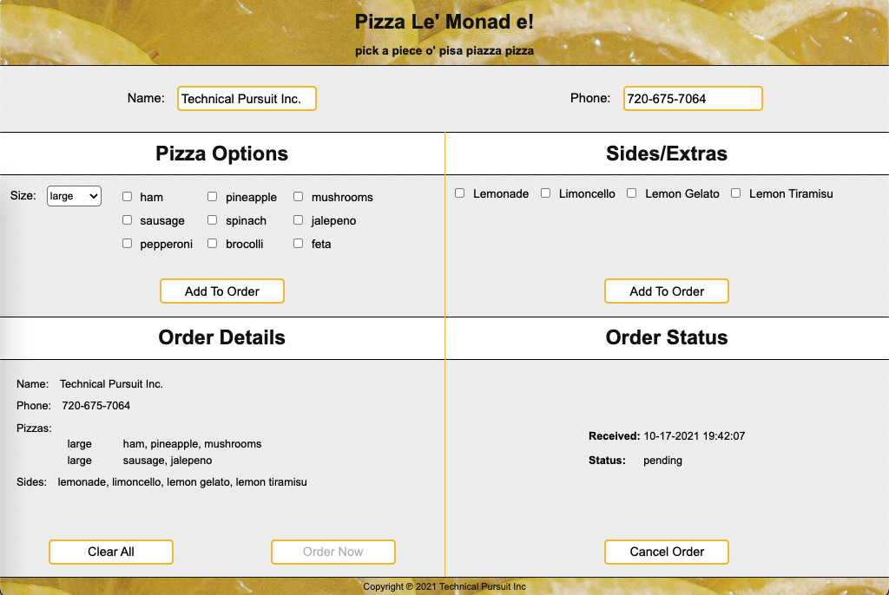

# Pizza Le' Monad e!



## Overview

Inspired by a failed attempt to build a pizza-ordering application under
pressure, the Pizza Le' Monad e! application was initially undertaken as an
exercise in turning lemons into lemonade.

    "The only true failures are unexamined ones."

In the spirit of examination and growth, Pizza Le' Monad e! was developed to
help TIBET grow; to (re)examine and exercise the main features of TIBET,
ensuring each works as intended, is easy to use, and has complete code samples
and test coverage.

Key features of the pizza application include:

- Markup-first authoring (XHTML templates linked to Object-Oriented types);
- Orthagonal markup enhancement via namespaced attributes (Markup "mixins");
- MVVM architecture with a loosely-coupled component data layer using URIs;
- Signal-driven behavior integration (without add/remove listener overhead);
- Full-stack functionality including quick and easy route/mock construction.

This application is intended as a permanent work-in-progress, evolving and
expanding to encompass TIBET's full feature set... and perhaps someday [ordering pizzas](https://github.com/RIAEvangelist/node-dominos-pizza-api) ;).

Pizza Le' Monad e! is also the go-to TIBET application you should refer to when
you want to see various aspects of TIBET in action... and then copy/paste them.

This document works through the high points of the application from server to
client. The source code is also heavily documented to assist your exploration.

**_New to TIBET? Start with Hello World! via [TIBET Quickstart](https://tibetjs.com/docs/quickstart.html) and [TIBET Essentials](https://tibetjs.com/docs/essentials.html)._**

On with the show...

## Installation

To work with this demo, first install/initialize TIBET:

```
npm install -g tibet
tibet init
```

Next, use `git clone` to clone the `TIBET-Examples` repository:

```
cd $WORKDIR
git clone git@github.com:TechnicalPursuit/TIBET-Examples.git
```

Once the clone is ready, `cd` to the `pizza` project subdirectory and use `tibet
init` to initialize the project and get it ready for use:

```
cd TIBET-Examples/pizza
tibet init
```

Once initialization is complete the application is ready to run.

## Startup

Starting the application consists of starting the [TIBET Data
Server](https://tibetjs.com/docs/tds.html) and opening the application URI to
load the client code into your web browser.

_NOTE: A Chromium-based browser such as Chrome or Edge Chromium is recommended._

#### TIBET Data Server (TDS)

To start the application server use `tibet start`:

```
$ tibet start

                            ,`
                     __,~//`
  ,///,_       .~///////'`
      '//,   ///'`
         '/_/'
           `
   /////////////////     /////////////// ///
   `//'````````///      `//'```````````  '''
   ,/`          //      ,/'
  ,/___          /'    ,/_____
 ///////;;,_     //   ,/////////;,_
          `'//,  '/            `'///,_
              `'/,/                '//,
                 `/,                  `/,
                   '                   `/
                                        '/
                                         /
                                         '

1634597538677 [7] TDS TIBET Data Server 5.5.0 (development)

...snipped...

1634526311463 [7] TDS pizza 0.1.0 @ http://127.0.0.1:1407#?boot.profile=development (dev)
1634526311463 [7] TDS pizza 0.1.0 @ http://127.0.0.1:1407 (production build) (build)
1634526311463 [7] TDS Application Started (server)
```

NOTE: to use a different port use the --port flag: `tibet start --port NNNN`.

#### TIBET Client Application

Once the server starts you'll see lines similar to those above. Use the first
link marked (dev) to open the application home page:

```
http://127.0.0.1:1407#?boot.profile=development
```

While the application is starting the browser will display a progress bar. Upon
completion you'll see the application's home page UI:


## Operation

Using the application is simple.

To enable sending an order to the server you need to enter a name, phone number,
and at least one pizza or side dish.

Once you've provided a name, phone number, and at least one product the `Order
Now` button will activate, allowing you to send the order JSON to the server.

With the order sent you can either cancel it (which sends it back to the
server for a status update) or reset the UI to set yourself up to create a new
order.

That's it.

The primary UI components which support this flow are outlined below.

#### pizza:info

Name and phone number are simple text entry fields. When they detect a changed
value they automatically cause the current order details to update.


#### pizza:options and pizza:sides

Adjust the pizza size if desired, select the toppings or side dishes you want, and click the
appropriate `Add To Order` button. Order details will reflect your planned
order.


#### pizza:orderdetails

Current order information is reflected in the `Order Details` section at the
bottom left. As you make changes they're reflected here.

Once the minimum requirements for an order are in place the `Order Now` button
is enabled.

You can clear/reset the UI at any time using the `Clear All` button.


#### pizza:orderstatus

In the demo application the server's `/order` route simply adds a timestamp and
status code and returns the order. The client responds by rendering that
information in the `Order Status` section, deactivating the `Order Now` button,
and activating the `Cancel Order` button.


Of course, the point isn't to order a pizza... at least, not yet.

The goal is to provide a foundation for demonstrating and testing key TIBET features.


## A Full Stack Framework

It's been said a key differentiating factor between libraries and frameworks is
"you call libraries; frameworks call you."

By that measure TIBET is a true framework; a full-stack framework composed
of a server, client, and integrated tooling.

The pizza application relies on the server to vend the client application and
support an `/order` route that accepts a JSON order, augments it, and returns
it.

The client stack is responsible for the look and feel (visual components and
user event handlers) which constitute the application interface.

The CLI supports the entire development and deployment lifecycle.

### The TIBET CLI

Earlier you used the `tibet init` command to initialize the application.

As you may have noticed, when `init` completes you're presented with additional command recommendations that let you lint, test, build, and start the application:

```
Initializing 'pizza' project with 'default' dna...
installing project dependencies via `npm install`...
linking TIBET into project via `npm link tibet`.
TIBET development dependency linked.
project initialized successfully.
Use `tibet lint` to check for coding standard violations
Use `tibet test` to test your application's core features
Use `tibet build --minify` to build production packages for deployment
Use `tibet start` to run your application.
```

Each of these are part of the [TIBET CLI](https://tibetjs.com/docs/cli.html),
TIBET's integrated command line tool.

TIBET projects are fully-instrumented with linting, testing, and building
features that let you keep your code clean, correct, and compact.

To see the currently available CLI options use `tibet help`:

```
$ tibet help

The tibet command can invoke TIBET built-ins, custom commands,
tibet make targets, grunt targets, or gulp targets based on your
project configuration and your specific customizations.

For a list of available commands use `tibet` or `tibet --help`.

`tibet help` lets you view documentation found in both your
project and in the TIBET library on any available subjects.

Project help topics include:

	sample

Library help topics include:

	tsh apropos build clone config context couch decrypt
	deploy doclint echo electron encrypt freeze help init
	lint make open package path quickstart reflect release
	resource rollup start strip tag tds test thaw tws type
	user version

pizza@0.1.0 /Users/ss/.nvm/v12.18.1/bin/tibet
```

### TIBET Data Server (TDS)

When you invoke `tibet start` the [TIBET Data Server
(TDS)](https://tibetjs.com/docs/tds.html), a penetration-tested
Node.js/Express server, launches and loads plugins handling security, logging,
etc.

The TDS also scans pre-defined 'routes' and 'mocks' directories, loading any
published route handlers it finds. Sample files are contained in each of these
directories so you have a starting point for server-side route and mock
development.

Built with a framework's "it calls you" model in mind, placing things in the
proper directory and following the proper naming conventions will cause the
server to automatically find, load, and activate your extensions.

You don't have to build a server, you just have to add the logic specific to
your routes and the TDS handles the rest.

#### `/order` Route

For the pizza application the relevant route file is `routes/order_post.js`, a
modified copy of the `routes/_sample_app_post.js` file included in every new
TIBET project.

To enable the `/order` route all that was needed was to copy the sample file
and update its `app.post` call as follows:

```
//  NOTE: to parse JSON or other content you need to define the specific
//  options.parsers value(s) your route relies upon. Here it's 'json'.

app.post('/order', options.parsers.json, function(req, res) {
    let response;

    logger.info(TDS.beautify(req.body));

    //  Simple implementation updates the order timestamp value and sets
    //  a new status based on whatever status was sent to us.
    req.body.received = Date.now();
    switch (req.body.status) {
        case 'pending':
        case 'cancelled':
            req.body.status = 'cancelled';
            break;
        default:
            req.body.status = 'pending';
    }

    res.json(req.body);
});
```

The TDS doesn't hot-rescan for new routes so if the server is running when you
make this kind of change you need to restart it to ensure it loads your new
route(s).

#### `/order` Testing

Each sample file includes instructions on how to test that route, typically by
using `curl` in combination with one or more static files from the `mocks`
directory.

To test the `/order` route a pair of JSON files were created with the planned
JSON for a new or existing order. These were placed in the `mocks` directory for
easy use:

##### `mocks/mock_neworder_post.json`

```
{
    "name":"Technical Pursuit Inc.",
    "phone":"720-675-7064",
    "pizzas":[
        {"diameter":"large","toppings":["sausage","jalepeno"]},
        {"diameter":"large","toppings":["ham","pineapple","mushrooms"]}
    ],
    "sides":["limoncello","lemon tiramisu"]
}
```

Invoking `curl` with that mock file lets us confirm the `/order` route is
working as intended:

```
$ curl -XPOST http://127.0.0.1:1407/order \
    --header "Content-Type: application/json" \
    --data "@./mocks/mock_neworder_post.json"

{"name":"Technical Pursuit Inc.","phone":"720-675-7064","pizzas":[{"diameter":"large","toppings":["sausage","jalepeno"]},{"diameter":"large","toppings":["ham","pineapple","mushrooms"]}],"sides":["limoncello","lemon tiramisu"],"received":1634528302460,"status":"pending"}
```

With the server route in place and tested it's time to move to the client.

Before moving on, the TDS has one more feature worth mentioning....

### Hot-Patching

In addition to loading plugins, routes, and mocks, the TDS optionally observes
all assets vended to the TIBET client and notifies the client of any edits you
make to those assets.

#### Server-side

Asset observation is provided by the TDS's `watch` plugin. When `NODE_ENV` is
`development` the `watch` plugin is automatically loaded. It's off for
production by default.

You can confirm the `watch` plugin is active by viewing the TDS's startup log:

```
...
1634526311357 [7] TDS loading tds plugin (watch)
1634526311357 [3] TDS TDS FileWatch interface creating file watcher. (watch)
...
1634526311463 [7] TDS Application Started (server)
```

#### Client-side

The TIBET Client includes hot-patch functionality so your changes can be
automatically integrated without reloading, preserving client-side application
state.

Launching the client using a `development` or `contributor` boot.profile
activates the client watcher. You can confirm this in the server's console log:

```
1634526313222 [3] TDS Processing file watch request from ::ffff:127.0.0.1 (watch)
1634526313327 [3] TDS Opening SSE notification channel to ::ffff:127.0.0.1 (watch)
1634526313327 [3] TDS TDS FileWatch connection count updated to 1 (watch)
```

TIBET's hot-patch functionality supports changes to your application's CSS,
XHTML templates, types, and tests, dramatically speeding development.

The development of the `pizza` application involved a handful of reloads but the
overwhelming majority was done by leveraging TIBET's hot-patch capability.

### The TIBET Client

The [TIBET Client](https://tibetjs.com/docs) is unique, offering a comprehensive client stack that's fully-integrated. This is in contrast to a-la-carte libraries, libraries where each project is composed of random assortments of modules and tools whose integration can pose challenges.

TIBET's not a-la-carte, it's all-the-parts.

TIBET Client layers exposed/leveraged in this demo include:

- [configuration](https://tibetjs.com/docs/configuration.html)
- [loading](https://tibetjs.com/docs/loader.html)
- [logging](https://tibetjs.com/docs/logging.html)
- [primitives](https://tibetjs.com/docs/primitives.html)
- [oo & traits](https://tibetjs.com/docs/oo.html)
- [signaling](https://tibetjs.com/docs/signaling.html)
- [urls/urns](https://tibetjs.com/docs/uris.html)
- [content](https://tibetjs.com/docs/content.html)
- [queries/paths](https://tibetjs.com/docs/paths.html)
- [templating](https://tibetjs.com/docs/templating.html)
- [data binding](https://tibetjs.com/docs/data-binding.html)
- [custom tags](https://tibetjs.com/docs/tag-system.html)

These layers will be called out when they appear in remainder of this document.

The application startup sequence kicks things off.

## Application Loading

Opening the pizza application loads a splash page containing the [TIBET Configuration](https://tibetjs.com/docs/configuration.html) layer and the [TIBET Loader](https://tibetjs.com/docs/loader.html), two of the key elements of the TIBET Client Stack.

The TIBET Loader loads the configured `boot.profile` (essentially a named manifest) and proceeds to load the application assets defined there. As the application loads you'll see a progress bar update as library and application assets are loaded.

The `#?boot.profile=development` fragment on the application URI defines a TIBET configuration value which informs the TIBET Loader to launch a development profile. _(You can alter any `boot.*` parameter (with certain restrictions) by adding it to the URI fragment.)_

As it loads and activates, each TIBET application leverages the [TIBET Logging](https://tibetjs.com/docs/logging.html) subsystem. This logging foundation includes both a "boot log" and application-level logging.

The boot log provides information on every asset loaded during startup along
with any warnings or other issues that might have occurred as your application
starts.

To toggle the boot log use `Alt-UpArrow` (aka `Option-UpArrow`):


If you open Chrome DevTools you'll also see TIBET log output in the console.

The logging layer has both `TP.*` and `APP.*` APIs. Log messages from TIBET show a 'TIBET' prefix while those from the `APP.*` APIs are prefixed by 'APP', making it easier to differentiate between framework and application messages.

You'll see multiple calls to `APP.*` logging methods in the application source code.

## Application Rendering

Once all application assets are ready the application is started and the splash screen is replaced with the application's root page. This root page can be summarized as a single tag:

```
<tibet:root/>
```

Upon expansion, the `<tibet:root/>` tag renders your application's "app tag" (`pizza:app` in this case) with optional development tools depending on your `boot.profile`.

The default rendering of `<tibet:root/>` resembles the following markup:

```
<html>
    <head/>
    <body>
        <pizza:app id="app"/>
    </body>
</html>
```

At the rendering level you can think of tags as macros which optionally expand to
produce new content in the DOM. _(Not all TIBET tags are UI tags as you'll see.)_

One standout feature is that TIBET is a fully-compliant XML platform, meaning
the rendering surface is an XML surface containing XHTML, not a "tag soup" HTML
surface.

Leveraging XML as the core rendering surface means TIBET can:

- retain/enhance semantic tag meaning rather than reverting to divitis
- style semantic XML directly using standard CSS namespace support
- bind directly to XML-formatted data without transformation overhead
- augment XML tags using namespace-qualified cross-cutting attributes
- support well-formed and schema-validation checks of authored content

When developing with TIBET you work from the app tag down, outlining the
interface and basic functionality in markup, then augmenting that markup with
behavior.

## `pizza:app`

The `pizza:app` tag is the first application-specific tag TIBET renders.

Once fully-expanded, the pizza application is composed of these key tags:

```
<pizza:app>
    <header/>
    <div class="body">
        <pizza:info/>
        <pizza:entry>
            <pizza:options/>
            <pizza:sides/>
        <pizza:entry>
        <pizza:order>
            <pizza:orderdetails/>
            <pizza:orderstatus/>
        </pizza:order>
    </div>
    <footer/>
</pizza:app>
```

The majority of the pizza application's functionality is found in the "leaf"
tags:

- pizza:info
- pizza:options
- pizza:sides
- pizza:orderdetails
- pizza:orderstatus

All but `pizza:info` use a common markup structure which lets them display
a section header, content region, and footer for buttons:

```
<header/>
<div class="body">
    ...content...
</div>
<footer/>
```

The `public/src/tags` directory contains a directory for each tag.

Each tag bundle contains the tag's xhtml template (if it's templated), its CSS,
its `.js` source and test files, and a tag manifest. This structure allows tags
to be packaged and shared across projects (with certain limitations).

Let's take a closer look at one of these tags, starting with the markup (of
course ;)).

## `pizza:sides`

The `pizza:sides` tag's role in the application is to render the side-dish
options (anything that's not a pizza) and support adding one or more sides to
the order.

Here's a look back at the choices (hope you like lemon... :)):


Below is a comment-stripped version of the project's `pizza:sides` tag template,
the template responsible for rendering that user interface:

### `pizza:sides.xhtml`

```
<pizza:sides>

    <tibet:data name="urn:app:pizza_sides" content="Array">
    <![CDATA[
        ["lemonade", "limoncello", "lemon gelato", "lemon tiramisu"]
    ]]>
    </tibet:data>

    <header>
        <h1>Sides/Extras</h1>
    </header>

    <div class="body" bind:repeat="urn:app:pizza_sides">
        <span class="field">
            <input name="{{$_}}" type="checkbox" value="{{$_}}"/>
            <label for="{{$_}}"
                on:click="{signal: ToggleItem, payload: {name: {{$_}}}}">{{$_ .% titleCase}}</label>
        </span>
    </div>

    <footer>
        <button name="sides" on:click="AddSides">Add To Order</button>
    </footer>
</pizza:sides>
```

Note that:

- **This template is fully-functional in terms of rendering. It renders the
  `pizza:sides` UI without writing a single line of JavaScript source code.**

    Why does that matter? It makes it perfect for low-code drag-and-drop tooling.

- Behavioral hooks are already in place. There's no need for `addListener` or
  `removeListener` to manage item toggling or button activation.
- The file is XML/XHTML and can be checked for well-formedness and validity
  against an XML schema if that's necessary or desirable. (Handy for shared tag
libraries).
- The markup is augmented by cross-cutting namespaced attributes in the
  TIBET-supplied `bind:` and `on:` namespaces.
- Commenting is a simple matter of using industry-standard XHTML comments.

### markup "mix-ins"

In much the same way traits allow you to "mix in" functionality to TIBET types,
TIBET's `bind:`, `on:`, `ui:`, and other namespaces let you mix functionality
into markup... any markup.

#### bind:

The use of a `bind:repeat` causes any child content of the element it resides on (the `<span class="field">` and its children in this case) to be extracted and used as a repeating template, blending features of TIBET [Data Binding](https://tibetjs.com/docs/data-binding.html) and [Templating](https://tibetjs.com/docs/templating.html).

The bind references `urn:app:pizza_sides`, a [TIBET URI](https://tibetjs.com/docs/uris.html) (specifically a TIBET URN) to point to the data being bound. Here the bind points to the URN defined by the template's `tibet:data` tag (which has the currently-static list of side dishes).

Raw data accessed via TIBET URIs is typically wrapped in an Object-Oriented container to make working with it easier. These raw data containers are often [TIBET Content](https://tibetjs.com/docs/content.html) types such as `TP.core.JSONContent`, `TP.core.XMLContent`, etc.

Through their integration with [TIBET Paths](https://tibetjs.com/docs/paths.html), TIBET's Content types provide a way to encapsulate raw data behind a consistent `get/set` API that insulates your code from changes to the structure of API results or other external data sets over time.

#### {{ }} templates

The templating block syntax `{{ }}` supports a variety of pre-built variables
and functions as well as custom extensions. In this template `$_` is used to
refer to the current iteration value and `.% titleCase` defines a small data
formatting pipe so the label value is in title case.

See the [TIBET Templating](https://tibetjs.com/docs/templating.html) documentation for more examples and information.

#### `on:*`

TIBET's `on:*` attributes allow you to remap DOM events and signals into
higher-level semantic signals which can be handled anywhere on the [responder
chain](https://tibetjs.com/docs/signaling.html#tagresp).

As you'll see later, the `defineHandler` method in `APP.pizza.sides.js` is used
to define the specific functions which will handle these events.

With TIBET there's no `addListener` or `removeListener` overhead or leak
potential, [TIBET Signaling](https://tibetjs.com/docs/signaling.html) takes care
of everything.

### `tibet:*` tags

While most frameworks use tags only for UI rendering, TIBET includes `info`
and `action` tags which can supply data or perform actions in response to
events.

The `pizza:sides` tag uses a `tibet:data` tag to demonstrate non-UI tags while
also showing one way to reduce or eliminate source code related to UI rendering.

The [TIBET Tag System](https://tibetjs.com/docs/tag-system.html) documentation
outlines the main features of TIBET's info, action, templated, and computed
tags.

The `pizza:orderstatus` tag is a good example of a `TP.tag.ComputedTag`, a tag
whose content is produced by a JavaScript method rather than an XHTML template.


## Types and Traits

TIBET's markup-first approach is made possible by a number of features, none
more important than TIBET's powerful [OO + Traits](https://tibetjs.com/docs/oo.html) foundation.

    "Behind every good tag is a good type." - TIBET mantra :)

Flexible feature reuse is the driving force behind TIBET's OO + Traits subsystem.

To maximize reuse while reducing maintenance issues you can use inheritance for
core functionality and dynamic trait mixins to manage cross-cutting features
efficiently.

### `pizza:sides.js`

The best example of how types and traits are leveraged in the pizza application
is the `pizza:sides` type and its integration of traits from the `pizza:items`
type:

```
//  ========================================================================
/**
 * @type APP.pizza.sides
 * @summary Tag type which manages the pizza sides portion of the UI. This tag
 * is where drinks, desserts, etc. are added to the order.
 */
//  ------------------------------------------------------------------------

TP.tag.TemplatedTag.defineSubtype('APP.pizza:sides');

APP.pizza.sides.defineAttribute('themeURI', TP.NO_RESULT);

//  Mix in checkbox items utility methods from the APP.pizza.items Type. NOTE
//  the resolveTrails for getItems to ensure the one used is being provided
//  by the APP.pizza.items mixin rather than the inherited implementation.
APP.pizza.sides.addTraits(APP.pizza.items);
APP.pizza.sides.Inst.resolveTraits(TP.ac('getItems'), APP.pizza.items);

//  Static data used to drive the list of available sides/extras in the UI.
APP.pizza.sides.Type.defineConstant('SIDES',
    TP.ac('lemonade', 'limoncello', 'lemon gelato', 'lemon tiramisu'));

//  ------------------------------------------------------------------------
//  Inst Attributes
//  ------------------------------------------------------------------------

APP.pizza.sides.Inst.defineHandler('AddSides',
function(aSignal) {

    /**
     * @method handleAddSides
     * @summary Responds to activation of the "Add To Order" button by ensuring
     *     the order is updated with any new sides/extras which are selected.
     * @param {TP.sig.Signal} aSignal The signal.
     */

    //  Update payload with current data values and let it bubble. The
    //  payload will be leveraged to update the raw order higher up.
    aSignal.setPayload(this.getSelectedValues());

    this.resetItems();
});

//  ------------------------------------------------------------------------
//  end
//  ========================================================================
```

From an inheritance perspective `pizza:sides` is a `TP.tag.TemplatedTag`. This
means it automatically leverages an XHTML template (`APP.pizza.sides.xhtml`) to
render.

The majority of tags in the pizza app (and most TIBET applications) are
templated tags.

The `pizza:sides` tag gets a significant base feature set (event management,
data binding, templating, and more) from `TP.tag.TemplatedTag` and its
supertypes.

The `defineHandler` call for `AddSides` ensures instances can deal with
activations of the `Add To Order` button (whose `on:click` maps click events to
`AddSides` signals).

One cluster of features isn't supported out of the box however, namely the
ability to quickly find, select, clear, toggle, and otherwise work with
`input[type="checkbox"]` descendants.

To address that limitation, `pizza:sides` gets its `getSelectedValues` and
`resetItems`, and `ToggleItem` handler functionality by mixing in `pizza:items`
as a set of traits.

### `pizza:items` (Traits)

Both the `pizza:sides` and `pizza:options` tags rely heavily on checkbox
elements. The pizza toppings are checkbox/label pairs. Drinks and desserts are
also checkbox/label pairs.

But is inheritance the best way to share checkbox field functionality?

In the pizza application the answer chosen was 'no' so a simple subtype of the
application's default root `APP.pizza.Object` was created to house it:

```
APP.pizza.Object.defineSubtype('APP.pizza.items');

//  Prevent instantiation. This type is intended for use as a mixin.
APP.pizza.items.Type.isAbstract(true);
```

_NOTE: While not strictly required, you can set trait types to be abstract so
any attempt to create instances directly will raise an exception._

To access the checkbox elements a [TIBET
Path](https://tibetjs.com/docs/paths.html) is defined. This path integrates with
TIBET's `get` and `set` methods so any attempt to `get('itemsCheckboxes')` or
`set('itemCheckboxes')` resolves the path and operates on the result:

```
//  Access path for locating all checkbox items under a target "body" div.
APP.pizza.items.Inst.defineAttribute('itemCheckboxes',
    TP.cpc('> div[class="body"] input[type="checkbox"]',
        TP.hc('shouldCollapse', false)));
```

TIBET supports access paths for XPath 1.0, JSONPath, CSS queries, and a
Python-inspired TIBET syntax for traversal/slicing down an object path. _(As
mentioned earlier, access paths are often used with TIBET Content types. This
approach lets you create "smarter data".)_

The remaining `pizza:items` API is defined via instance methods:

- getItems
- getSelectedItems
- getSelectedValues
- reset
- resetItems

A common Signal handler is also defined via `defineHandler`:

- ToggleItem

By mixing in `pizza:items` functionality `pizza:options` and `pizza:sides`
gain a new attribute (the access path), new instance methods, and a new
signal handler.

### `pizza:options.js` and `callNextMethod`

One feature of TIBET's OO + Traits infrastructure deserves a special callout.

When you override a method in standard JavaScript you can use `super()` to
direct the engine to invoke any inherited implementation. It's not perfect
but it works for most cases.

TIBET's base inheritance implementation addresses the gaps in `super()`
invocation while also handling the introduction of traited methods.

In the specific example below, the `pizza:options` type has mixed in the
`pizza:items` type and acquired a `reset` method as a result of that operation.

Because `pizza:options` has a `<select>` control that should be reset in
addition to its checkboxes, `pizza:options.reset` needs to override the traited
method and invoke it internally to retain the traited support for checkboxes.

Of course, it can't use `super()` because `super()` has no concept of traits.
That's where `callNextMethod` method comes in.

TIBET's `callNextMethod` method is aptly named in that it literally calls "the
next method" in the call chain, whether that "next method" is on the receiving
object's direct type, a mixed in trait, a supertype, a trait of that supertype,
etc.

```
APP.pizza.options.Inst.defineMethod('reset',
function() {

    /**
     * @method reset
     * @summary Reset all field values to their initial defaults.
     * @returns {APP.pizza.options} The receiver.
     */

    //  NOTE: this actually invokes a TRAIT method, 'reset', acquired from
    //  mixing the APP.pizza.items type. The callNextMethod is unlike super() in
    //  that it works to find truly "the next method in the call chain".

    this.callNextMethod();

    this.setPizzaSize(APP.pizza.pizza.get('DEFAULT_SIZE'));

    return this;
});
```

Thanks to `callNextMethod` you can mix in functionality without compromise.

## Controllers

Tag types are a central aspect of authoring TIBET applications. Still, not
everything in an application happens in the UI. That's where the TIBET
controller stack comes in.

Events in a browser typically start at the document, work downward to a target
node, then bubble upward to the document again. This capture/bubble pattern is
canonical.

In a similar fashion, TIBET signals start at the top of the controller stack,
work downward, descend into the DOM, change direction, and work upward from the
target node to the top of the controller chain.

Capture and bubbling semantics are preserved, but controller objects are now
available at the start of the capture sequence and the end of the bubbling
sequence.

Thanks to the controller chain you can quickly capture or provide backstop
functionality in response to lower-level `Event` and `TP.sig.Signal`
notifications.

The most prevalent consumer of these notifications is the 'application
instance', one of the controllers TIBET automatically creates and configures on
your behalf.

### TP.core.Application

In a production setting the top of the controller chain is the `Application`
instance, accessible via `TP.sys.getApplication()`. The rest of the controller
chain can be acquired from the application instance via `getControllers()`.

The application instance is created automatically by TIBET during application
startup using a pre-built subtype of `TP.core.Application`. This application
subtype is generated during project creation via the `tibet clone` CLI command
and placed in `public/src`.

In the pizza app that Type is `APP.pizza.Application`.

### APP.pizza.Application

The application instance is a common location to host "cross-component" data,
manage event signaling/handling, and coordinate other shared functionality.

For example, the `APP.pizza.Application` definition includes the following lines
of code which help manage data for the current `order`:

```
//  Location used to share the Order data.
APP.pizza.Application.Type.defineConstant('orderURN', TP.uc('urn:app:order'));

//  Reference to the server-side URI used to POST order requests.
APP.pizza.Application.Type.defineConstant('serverURI',
TP.uriExpandHome('/order'));

//  The order data. This is also shared as the content of the orderURN.
APP.pizza.Application.Inst.defineAttribute('order');
```

Instance methods on the application instance include the following:

- clearOrder
- getOrderURN
- getServerURI
- orderChanged

Each method supports working with order data, the application's primary task.

A secondary task for many application instances is handling lifecycle events.

#### Lifecycle Signals

From a signal-handling perspective one of the more common application lifecycle
events is `AppDidStart` (others include AppWillStart, AppWillShutdown,
AppDidInitialize, etc.)

`AppDidStart` is invoked after all loading, initialization, and rendering of the
initial user interface is complete so it's the typical Signal to handle as a
kind of application kick-off.

The pizza application uses `defineHandler('AppDidStart', ...)` so it can perform initialization of the order data:

```
APP.pizza.Application.Inst.defineHandler('AppDidStart',
function(aSignal) {

    /**
     * @method handleAppDidStart
     * @summary Responds to notification that the application has started. In
     *     particular, this invocation ensures the order is properly initialized
     *     and ready to capture data.
     * @param {TP.sig.Signal} aSignal The signal.
     */

    this.clearOrder();
});
```

#### Cross-Component Signals

To coordinate activities and data across components while maintaining loose
coupling, the application instance also defines handlers for:

- UpdateOrderInfo (pizza:info)
- AddPizza (pizza:options)
- AddSides (pizza:sides)
- ClearOrder (pizza:orderdetails)
- SendOrder (pizza:orderdetails)

These additional signal handlers let the application coordinate with various
UI components so the UI works without individual components having to
connect directly to each other.

## Client/Server

Connecting the client and server is the last topic covered.

Order initiation is handled by the `APP.pizza.Application` instance's
`SendOrder` handler, typically triggered by the `Order Now` button.

Order cancellation is handled by `pizza:orderstatus` instance's handler for
`CancelOrder`, triggered by the `Cancel Order` button.

Each of these handlers relies on a "TIBET primitive", aka an encapsulating
function which stabilizes TIBET's APIs across platforms. In this case, it's the
`TP.httpPost` primitive.

[TIBET Primitives](https://tibetjs.com/docs/primitives.html) cover an extensive
set of functions and provide a stable foundation for the rest of TIBET. While
they might appear to be "shims" they differ in that TIBET uses primitives to
create an dependable encapsulation layer rather that patching one-off functions.

Here's the `APP.pizza.Application` instance's `SendOrder` handler, which makes
use of the `TP.httpPost` primitive to POST the order JSON to the server:

```
APP.pizza.Application.Inst.defineHandler('SendOrder',
function(aSignal) {

    /**
     * @method handleSendOrder
     * @summary Responds to requests to send the order to the server for
     *     processing.
     * @param {TP.sig.Signal} aSignal The signal.
     */

    let order,
        request;

    order = this.get('order');

    //  Ensure any status flag from prior state (such as pending or
    //  cancelled) is cleared.
    delete order.status;

    //  Prep the request as a JSON string and prevent any further encoding.
    request = TP.hc('body', TP.json(order), 'noencode', true);
    APP.debug(request);

    //  Send to the server endpoint and handle success/failure. NOTE that using
    //  an arrow function here walks up the scope chain for 'this' resolution.
    TP.httpPost(this.getType().get('serverURI'), request).then((result) => {
        APP.debug(result);
        //  Update the order with the augmented (order status & time) order.
        this.set('order', JSON.parse(result));
        this.orderChanged();
    }).catch((err) => {
        //  Log any error but don't clear the order.
        APP.debug(err);
    });
});
```

TIBET's `TP.http*` primitives return "thenables" (typically `Promise` instances)
which can be used to manage async resolution/rejection processing.

_(TIBET's Response objects are also thenables and can participate in async chains.)_

In the specific case above, successful POST operations are handled by updating
the copy of the order with the parsed JSON response data. The `orderChanged`
method is then invoked to handle notifying potential observers of the new
change.

Components dependent on order data are configured to observe `OrderChange` from
the application so they can update their UI and state as needed.

## Result Processing

Perhaps the best example of observing and reacting to order responses (or more
specifically order changes) is the `pizza:orderstatus` tag.

As implemented, `pizza:orderstatus` needs to re-render whenever the order
changes. It manages this by setting up an observation of the application instance for
`OrderChange` in its instance initializer (`init`) and using `defineHandler` to
set up change handler logic.

Here are those methods (stripped of comments):

```
APP.pizza.orderstatus.Inst.defineMethod('init',
function() {
    this.callNextMethod();
    this.observe(TP.sys.getApplication(), 'OrderChange');
    return this;
});

APP.pizza.orderstatus.Inst.defineHandler('OrderChange',
function(aSignal) {
    //  "recompile" and force the new content to replace existing content.
    this.compile(null, true);
});
```

The `this.compile(null, true)` logic here ultimately results in the `tagCompile`
method of the `pizza:orderstatus` type being invoked.

The `tagCompile` method makes a determination based on order content whether to
render instructions or order status information. It also determines the
`disabled` state of the `Cancel Order` button. _(While this functionality could
be managed in markup, for test/demo purposes it's been placed in a compiled
tag.)_

With this final piece in place, the loop from construction of the server's
`/order` route through handing the response to drive UI updates is complete.

## Summary

The pizza application's goal is to provide a testbed for, and demonstration of,
core TIBET functionality across the full stack.

This document has outlined some of the major aspects of the application, the
TIBET feature set, and relevant sections in the TIBET documentation
suite.

We invite you to explore further by digging into the project code, playing with
the project's template files, source code, and other features.

Application server logic resides at the top project level in numerous
directories, the most important of which are `plugins`, `routes`, and `mocks`.

Primary client types are in `public/src`, general purpose types are found in
`public/src/types`, and the various tags are found in `public/src/tags`.

<br/>
Happy hacking!

<br/>
-- Team TIBET
